# CLion的安装、配置与使用 以及如何对代码进行调试(debug)

## 1.编译器的安装
- Win

	 MinGW，[点此下载](https://pan.baidu.com/s/1I_TIYaPc2go7uNm2jEhXlg) ，解压密码：hpat
	
	 下载完毕将压缩包内容解压到C盘下（个人习惯，放其他位置也可，但需记住所放位置）
	 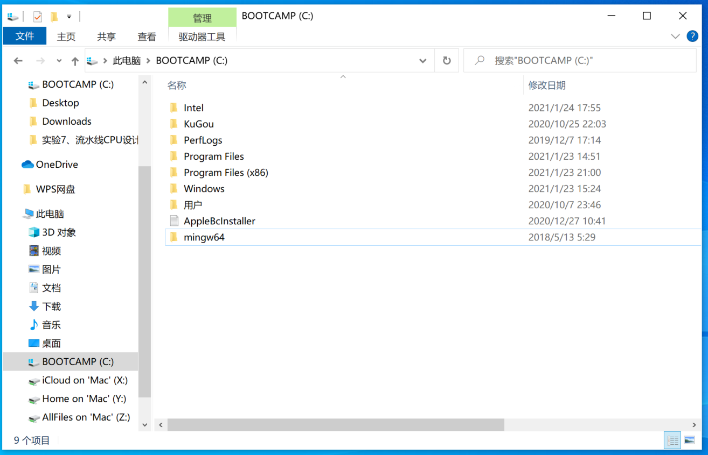

- Mac 

	终端执行

```
  xcode-select --install
```

## 2.下载安装Clion

- 地址：[点此下载](https://www.jetbrains.com/zh-cn/clion/download/#section=windows)
- 下载后正常安装即可
- 安装后弹出登陆选项，此时需要注册一个教育账号即可激活，[点此注册](https://www.jetbrains.com/zh-cn/community/education/#students)
- 进入后用教育（中大）邮箱注册
- 注册后登录激活即可（若注册失败也可尝试使用本人账号激活**username:1159292671@qq.com,password:#Xhx0530!**）

## 3.开始使用，运行自己的第一个程序

- 创建工程

  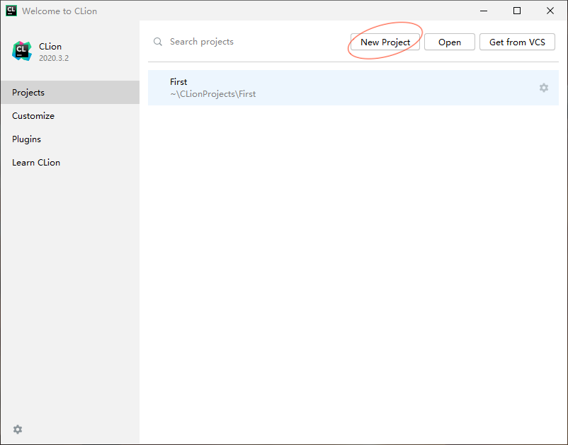

- 选择C语言工程，并为工程命名

  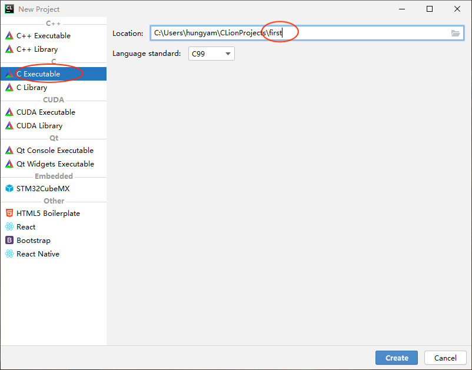

- 进入设置

  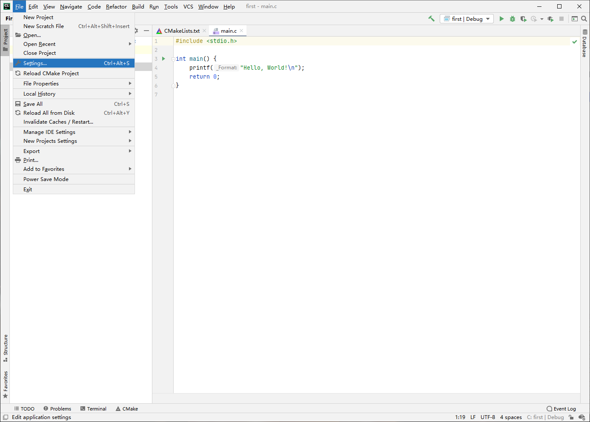

- 选择Toolchains->MinGW

  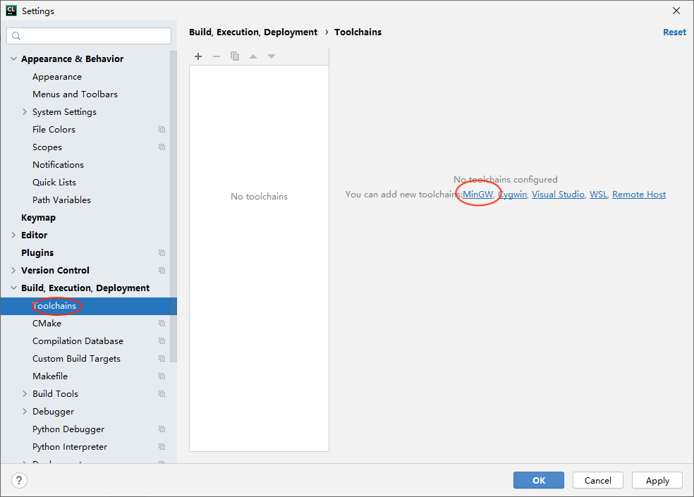


- 若MinGW解压在C盘根目录下，一般将自动识别，若识别失败，也可自己填写所在位置**C:\mingw64**（我将MinGW解压在C盘根目录，如果你的不是，按照你的情况改地址即可）

  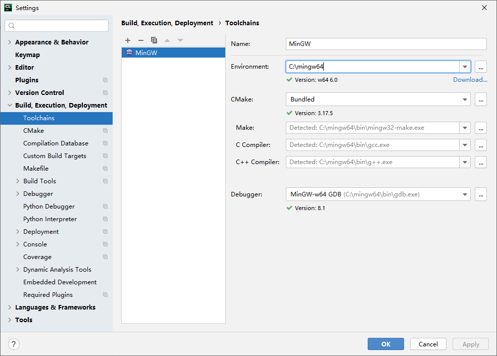

  

- 保存设置即可运行第一个程序，点击右上角开始按键

  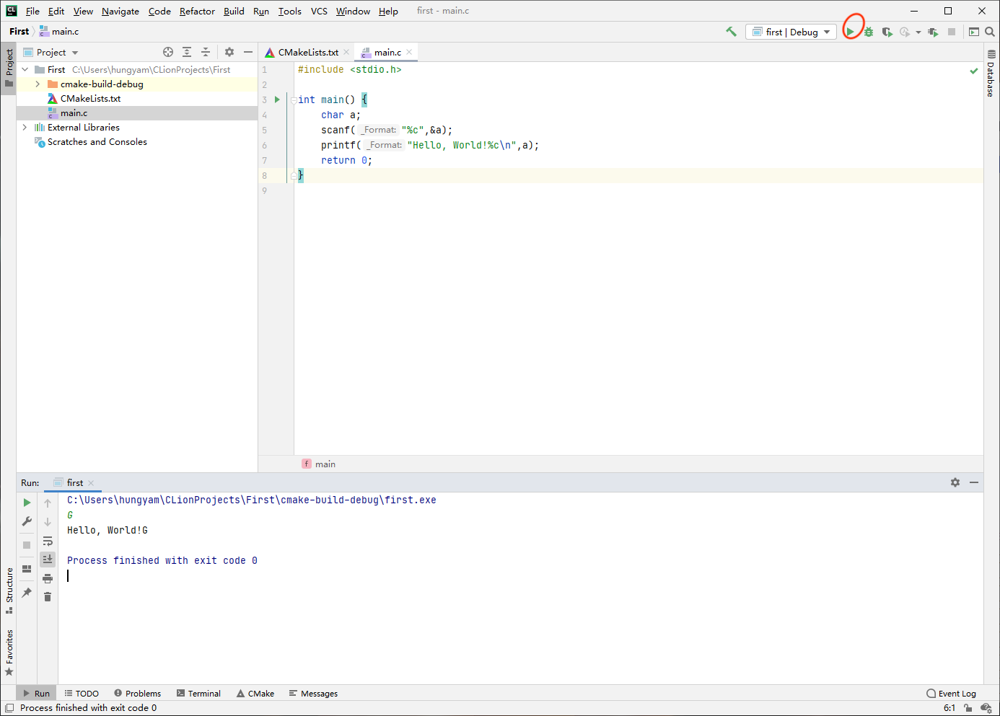

> 至此软件配置成功，需要做另一个程序按上述步骤创建运行即可，不必再选择编译器

## 3.如何调试自己的程序

1. 这里给一个样例，点击一下序号右边，会出现小红点（程序断点，表明程序执行到此处将暂停），接着点击运行案件右侧的调试按键。

   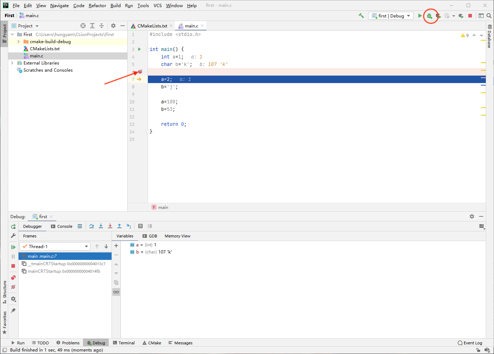

可以看见此时下方有变量面板，表示运行到黄色箭头处，当前变量的值为多少（此时a为1，b为107(对应ascii的字符k)）

- 点击下一步按钮，程序走向下一行

  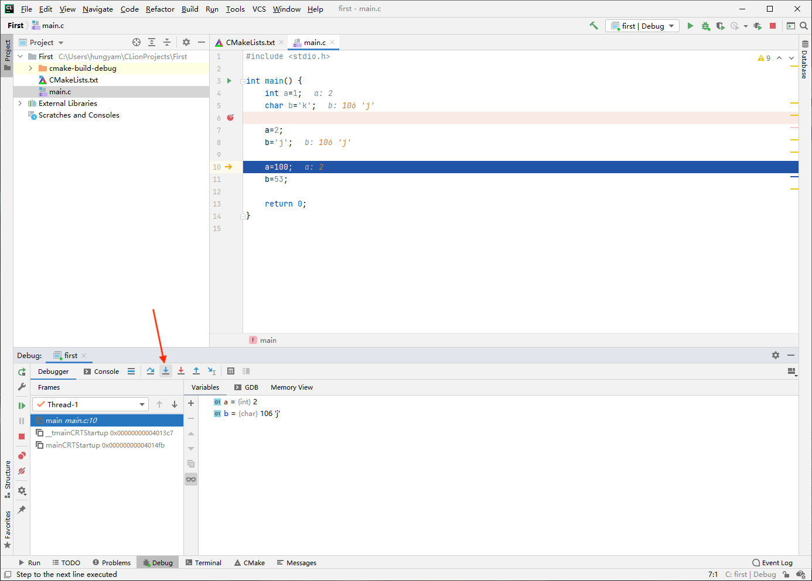

  此时变量相应改变

  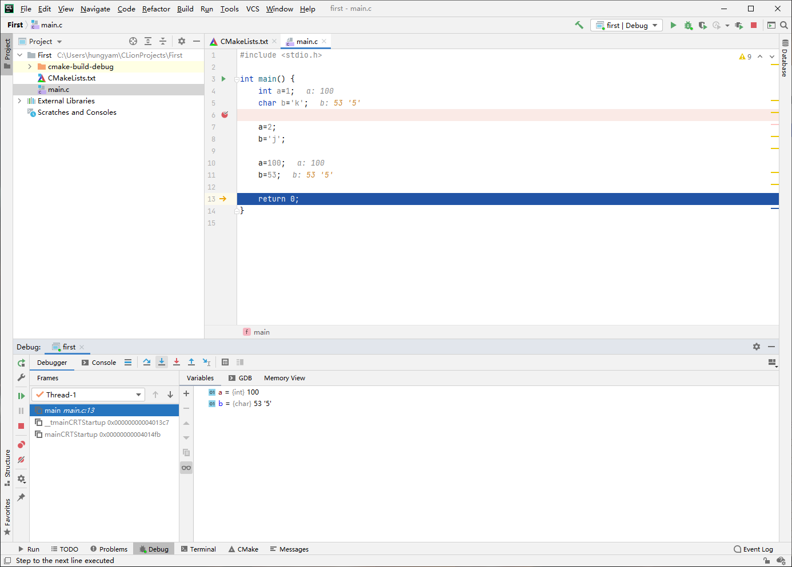

> 使用调试器，能极大地帮助我们调试我们的程序，当我们写了Bug，便能够较为轻松地检查错误，并改正，真正做到高效。

## 4. 代码联想与编写时同步提醒

   该IDE的一大特点，在你未运行前，能提前告知你可能会出现错误的地方，并给出建议的解决办法，如下图的程序（这里引用一位学弟所编写的代码）

   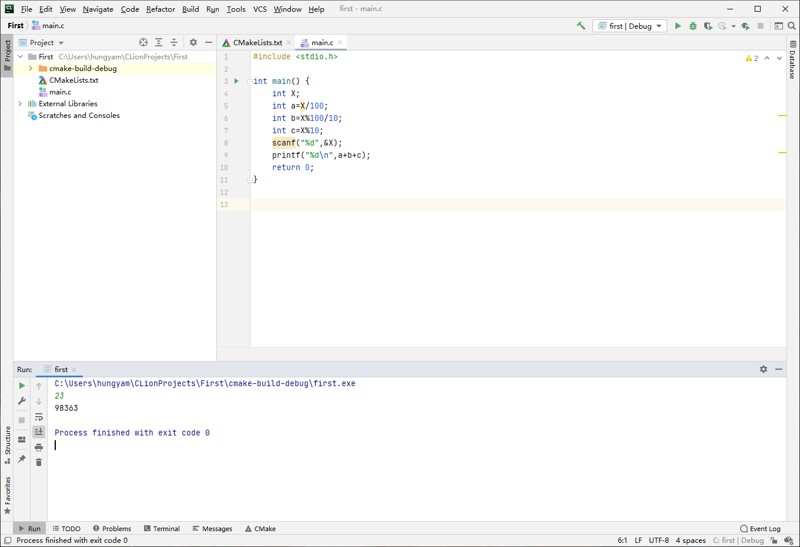

   为什么值错了呢？由于C语言是一行一行运行的，未输入前先做运算导致此程序出错。

   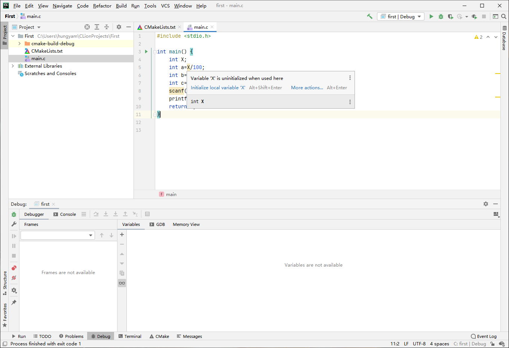

   告诉你X还未初始化，说明还没有值，这样就能发现自己的代码顺序出问题了吧！


