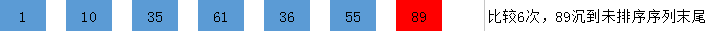

[TOC]

排序算法：即把一串无序数列，按照从大到小或者从小到大的规则进行排列。

- 数组：C语言数组可理解为多个连续相同变量的集合。
- 定义方法如下：

```c
int num[10];			//长度为10的整数数组，即10个int变量的集合
char str[20];			//长度为20的字符数组，同时可以存字符串（长度最大为19）
double n[30];			//长度为30的双精度数组，即30个double变量的集合
```

  - 读与写：

  > 注意C语言习惯从0开始，数组下标（中括号中的数字称为下标）规定以0开始，因此开10个长度的数组，最大只能访问到下标9，如下面使用：

  ```c
  int num[10];
  num[9]=2;			//accept
  num[10]=1;		//error，数组越界
  printf("%d",num[10]); //error
  ```

  > 即定义时的num[10]中的10表示的是长度，要与之后的使用相区别，10个长度的数组对应的变量为`num[0],num[1],...,num[9]`共10个。
  >

	下面是几种初始化方法：

  ```c
  int num[10]={1,2,3,4,5,6,7,8,9,10}; //初始化
  //num[0]~num[9]分别对应 1～10
  
  int n[10]={0};	//初始化，全为0

  char str[20]="hello!";   //初始化，字符串，一个一个字符赋值
  //str[0]~str[6]分别对应 'h''e''l''l''o''!''\0',最后一个为字符串结束符号
  //因此20长度的char数组只能存长度为19的字符串
  ```

  对数组的读与写：

  ```c
  int num[10]={1,2,3,4,5,6,7,8,9,10};
  char str[20]="hello!";
  
  //read
  int b=num[3];	//b=4
  printf("%d %d",num[9],b); //output: 10 4
  
  //write
  num[4]=99;
  str[0]='H';
  printf("%c %d %s",str[0],num[4],str);//output: H 99 Hello!
  ```

- 排序算法（这里介绍冒泡排序）

  前面提及的数组，为的就是存进一串无序数，并在数组中对其进行排序

  - 原理：比较两个相邻的元素，将值大的元素交换到右边

  - 思路：依次比较相邻的两个数，将比较小的数放在前面，比较大的数放在后面。

  1.第一次比较：首先比较第一和第二个数，将小数放在前面，将大数放在后面。

  2.比较第2和第3个数，将小数 放在前面，大数放在后面。

  　　......

  3.如此继续，知道比较到最后的两个数，将小数放在前面，大数放在后面，重复步骤，直至全部排序完成

  4.在上面一趟比较完成后，最后一个数一定是数组中最大的一个数，所以在比较第二趟的时候，最后一个数是不参加比较的。

  5.在第二趟比较完成后，倒数第二个数也一定是数组中倒数第二大数，所以在第三趟的比较中，最后两个数是不参与比较的。

  6.依次类推，每一趟比较次数减少依次

下面先上代码：

```c
#include<stdio.h>
int main(){
    int num[20] = {0};
    int n;
    scanf("%d",&n);//输入排序个数
  
  	//按顺序输入num[0]~num[n-1]
    for (int i = 0; i < n; i++) {
        scanf("%d",&num[i]);
  }
  
    //冒泡排序算法
    for (int i = 0; i < n-1; i++) {
      //大循环做的是控制趟数，做n-1趟即可保证数组有序
        for (int j = 0; j < n-i-1; j++) {	
          //里面的循环做的是一趟从左到右两两比较的工作，可理解为将较大的值一直往右推，做完完整的一次循环，可保证最右的为最大值（第一趟）。
            if (num[j] > num[j+1]) {		//交换
                int temp = num[j];
                num[j] = num[j+1];
                num[j+1] =temp;
            }
        }
    }
    
  	//按顺序输出num[0]~num[n-1]
    for (int i = 0; i < n; i++) {
        printf("%d ",num[i]);
    }
    printf("\n");
    return 0;
}

```

假设输入：

```c
7
10 1 35 61 89 36 55
```

执行过程：

1. 要排序数组:[10,1,35,61,89,36,55]


2. 第一趟排序：

第一次排序：10和1比较，10大于1，交换位置 　  [1,10,35,61,89,36,55]

第二次排序：10和35比较，10小于35，不交换位置　　[1,10,35,61,89,36,55]

第三次排序：35和61比较，35小于61，不交换位置　　[1,10,35,61,89,36,55]

第四次排序：61和89比较，61小于89，不交换位置　　[1,10,35,61,89,36,55]

第五次排序：89和36比较，89大于36，交换位置　　　[1,10,35,61,36,89,55]

第六次排序：89和55比较，89大于55，交换位置　　　[1,10,35,61,36,55,89]

​    第一趟总共进行了六次比较，排序结果：[1,10,35,61,36,55,89]



3. 第二趟排序：

第一次排序：1和10比较，1小于10，不交换位置　　1,10,35,61,36,55,89

第二次排序：10和35比较，10小于35，不交换位置  1,10,35,61,36,55,89

第三次排序：35和61比较，35小于61，不交换位置   1,10,35,61,36,55,89

第四次排序：61和36比较，61大于36，交换位置　　　1,10,35,36,61,55,89

第五次排序：61和55比较，61大于55，交换位置　　　1,10,35,36,55,61,89

　第二趟总共进行了5次比较，排序结果：1,10,35,36,55,61,89

　　　4.  第三趟排序：

第一次排序：1和10比较，1小于10，不交换位置　　1,10,35,36,55,61,89

第二次排序：10和35比较，10小于35，不交换位置  1,10,35,36,55,61,89

第三次排序：35和36比较，35小于36，不交换位置   1,10,35,36,55,61,89

第四次排序：36和61比较，36小于61，不交换位置　　　1,10,35,36,55,61,89

​    第三趟总共进行了4次比较，排序结果：1,10,35,36,55,61,89

​			......

​	第六趟排序结束，可保证7个数有序

# Break and Continue

循环语句中的特殊使用

- break：循环中执行该语句后将直接跳出循环，如：

```c
#include <stdio.h>
int main(){
  int n=0;
  while(1) {
    if(n == 10)
      break;
    printf("%d ",n);
    n++;
  }
  return 0;
}

//Output: 0 1 2 3 4 5 6 7 8 9
```

- continue：循环中执行该语句将放弃执行循环体中该continue语句后的指令，走下一个循环（还是需要按循环要求判断条件）

```c
#include <stdio.h>
int main(){
  int n=0;
  while(n <= 5) {
    printf("%d ",n);
    if(n%2 != 0){
      n++;
      continue;
    }
    printf("is an even number\n;",n);
  }
  return 0;
}

/*Output: 
0 is an even number
1 2 is an even number
3 4 is an even number
5			
*/
```

- switch中的break是离开当前switch循环语句的作用，一般需加上，否则将进入下一个case语句，如：

```c
switch(x) {
  case 1:
  //代码执行到此处
  case 2:
  default:
}
```

> 假设`x=1`，则程序跳转到开始执行case 1的代码，若case1结束没有break，则将继续执行case2，一直执行下去，直到遇到break或者结束


​			