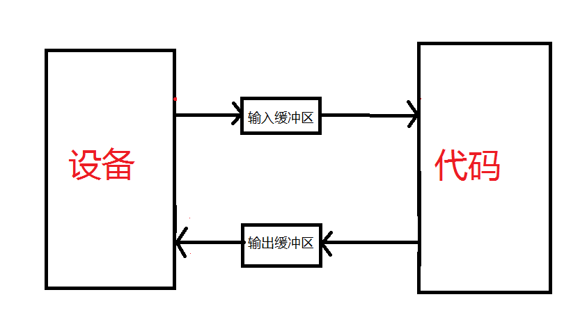
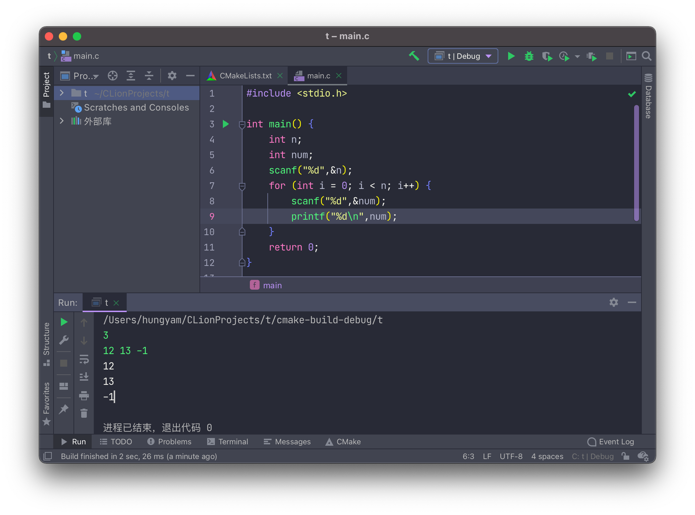
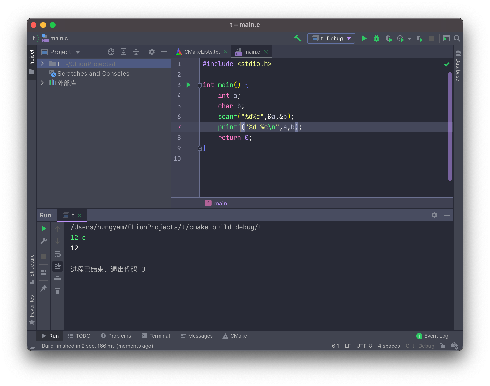
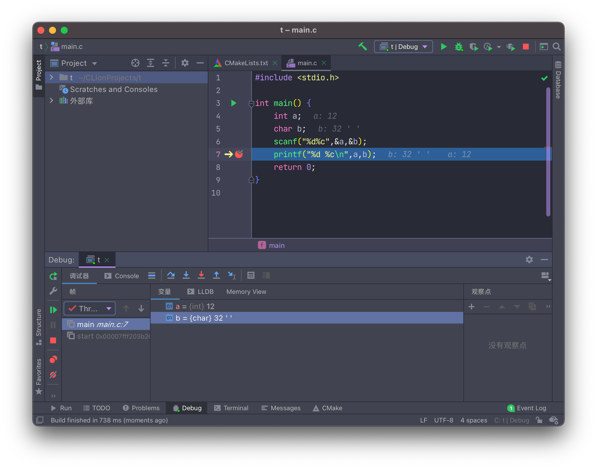
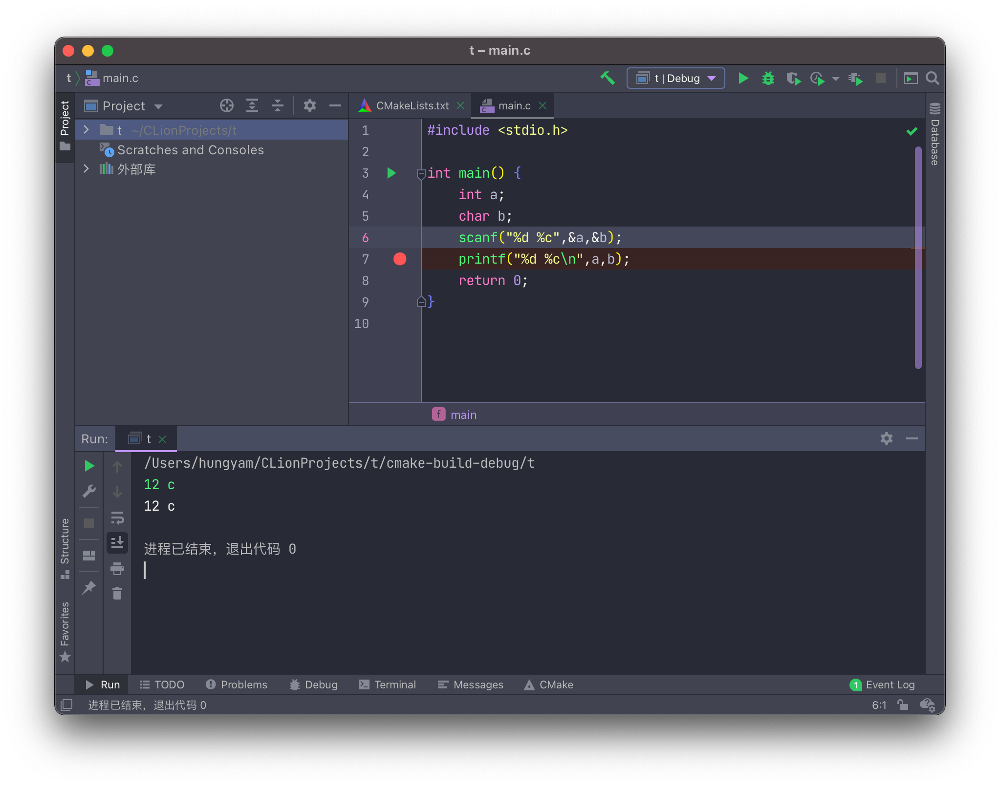
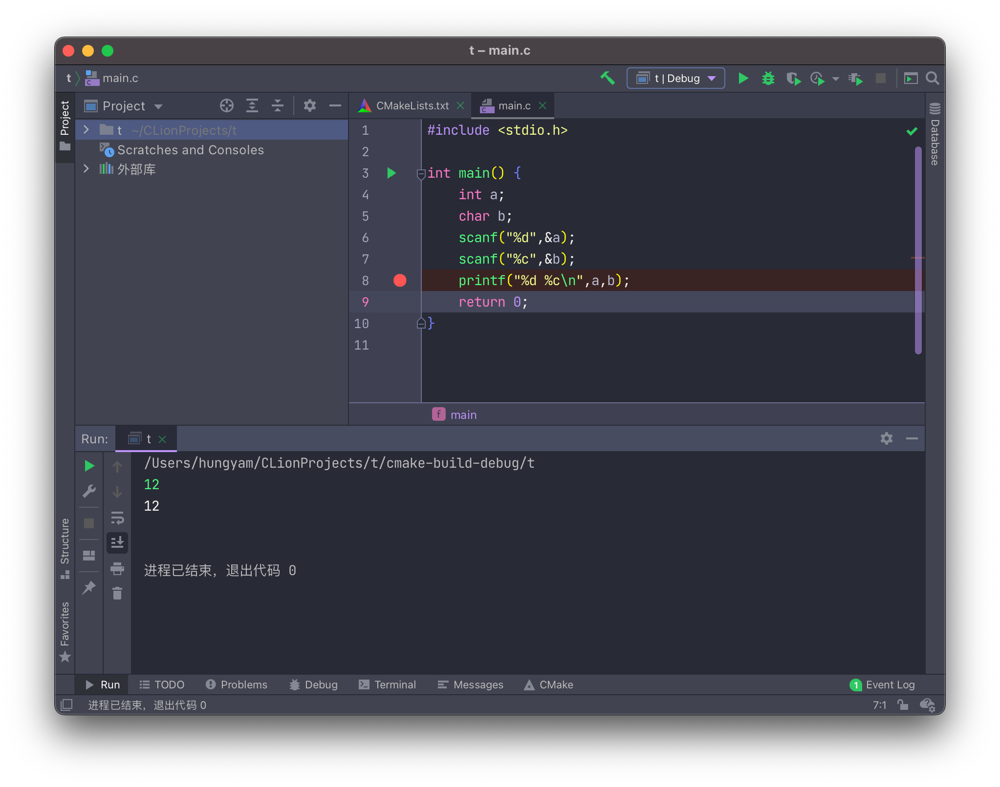
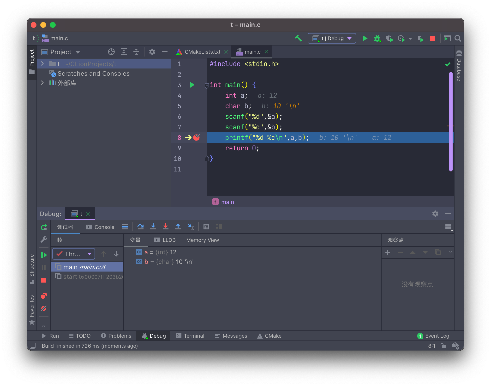
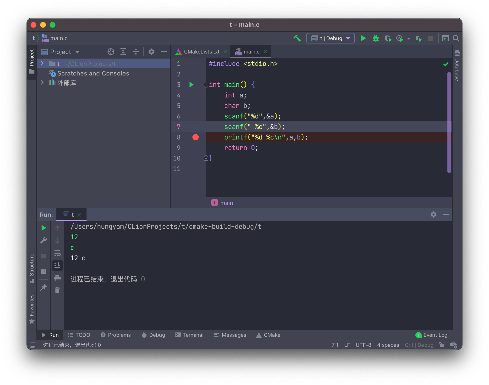

# 输入缓冲区与scanf( )的详细解读

## 输入缓冲区

C语言中我们用到的最频繁的输入输出方式就是scanf()与printf()。

- scanf()： 从标准输入设备(键盘)读取数据，并将值存放在变量中。

- printf()： 将指定的文字/字符串输出到标准输出设备(屏幕)。

但从键盘读入数据到程序变量之间还有一个东西起着至关重要的作用------缓冲区（如下图）



但缓冲区具体如何工作的呢？

当我们从键盘上输入输入某些内容（未敲回车前），这些内容将被读进缓冲区，等待被处理。直到敲击了回车键，回车键是将缓冲区内容提交到程序代码中的标志。

> 特别要注意的是，作为标志的回车键本身也是字符（\n 换行符）

因此，假设我在键盘上输入Love并按下回车，缓冲区应该是先读入换行符，再进行提交。

 过程如下：

 ​	键盘输入:   					Love (回车)

 ​	缓冲区内容:       			Love\n    (得到提交要求)

 ​	程序获取缓冲区内容:    Love\n

看到这里，或许还是不清楚\n会对输入带来什么影响。在文章的后面内容会有关于字符读入的更详细的例子。

引入缓冲区的原理，当然是要服务输入输出函数的，scanf和printf是搭配使用的函数，他们使用方法基本一致，只是一个负责输入，一个负责输出。

## 解读scanf( )

```
scanf("%d %d",&n,&m);
```

- 第一个参数格式化输入控制字符串（C语言中双引号中的内容表示字符串）即“%d %d”，在printf这个字符串用来规定打印在屏幕上内容的格式，对其加空格，让变量以何种形式展现等等，scanf中也一样，规定我们要以何种方式来输入。
- 后面的变量是与第一个参数（字符串）相对应的接收输入数据的变量地址列表。（地址这个概念这里先不多做赘述，这也就是为什么scanf变量要加上&的原因，先理解为变量按顺序匹配字符串中的%就行）

### **说多概念无益，直接上代码**

```C
#include <stdio.h>
int main()
{
    int a, b, c;

    scanf("%d %d", &a, &b);
    printf("a+b=%d\n", a+b);

    scanf("%d   %d", &a, &b);
    printf("a+b=%d\n", a+b);

    scanf("%d, %d, %d", &a, &b, &c);
    printf("a+b+c=%d\n", a+b+c);
   
    scanf("%d is bigger than %d", &a, &b);
    printf("a-b=%d\n", a-b);

  	scanf("%d%d", &a, &b);
    printf("a+b=%d\n", a+b);
    return 0;
}
```
运行结果：

```
10    20↙			//输入(↙表示回车)
a+b=30
100 200↙			//输入(↙表示回车)
a+b=300
56,45,78↙			//输入(↙表示回车)
a+b+c=179	
25 is bigger than 11↙			//输入(↙表示回车)
a-b=14
10 20↙					//输入(↙表示回车)
a+b=30
```

- 第一个 scanf() 的格式控制字符串为`"%d %d"`，中间有一个空格，而我们却输入了`10  20`，中间有多个空格。
- 第二个 scanf() 的格式控制字符串为`"%d  %d"`，中间有多个空格，而我们却输入了`100 200`，中间只有一个空格。

>  这两个例子说明 scanf() 对输入数据之间的空格的处理比较宽松，并不要求空格数严格对应，多几个少几个无所谓，只要有空格就行。

- 第三个 scanf() 的控制字符串为`"%d, %d, %d"`，中间以逗号分隔，所以输入的整数也要以逗号分隔。

- 第四个 scanf() 要求整数之间以`is bigger than`分隔。
- 第五个 scanf() 格式控制字符串为`"%d%d"`，但也能正常读入，为什么呢？

> 这里就是缓冲区在起作用了，缓冲区的内容会被scanf一个一个比对读取。

1. 首先10被%d(整数)匹配上，10赋值给a
2. 接着空格跟下一个%d匹配不上，因为空格为字符(char)，而%d是整数
3. 最后20还是跟这个%d匹配，匹配上，20赋值给a

所以能发现，对多个整数的输入来说，输入似乎没那么严格，无论是输一个提交一个或者是一次性输入完都能得到一样的结果

**如下面这个程序**



按代码思路，应该是一次输入带一次输出才对，为何又能做到三个数输入完，再三个数都输出出来呢？

这就是上面提到的缓冲区原理，`12 13 -1`被我们放进缓冲区，按下回车后遇到scanf缓冲区便会为我们提交一段内容，如上面这题先是12被提交进第一个scanf然后打印12，接着13提交进第二次的scanf，再打印13......

由于缓冲区的提交我们无法看见，这样就让我们觉得输入和输出分开了，其实确实是一次输入跟着一次输出。缓冲区可以理解为对程序的一种计划。

当然我们也完全可以不利用缓冲区的特性，自己一次一次地提交：


但其实输出的内容是一样的，都是：

```
12
13
-1
```

> 输入的东西不能当做输出

### **当存在字符输入时就要额外小心了**

看下面这个例子：



这里scanf中的为`"%d%c"`，中间没有空格

我输入了`12 c`但发现输出只有12，为什么呢，我们进行调试如下图：



出现了很意外的情况，b的值是32（也就是空格）

这是因为输入缓冲区的空格与%c匹配上（空格是字符），因此修改一下scnaf中字符串即可



**其实这样还比较好看出问题**

有时会出现两个scanf分开的情况，如下面的例子：



但我输入`12(回车)`，程序直接结束，原因就是上面提到的缓冲区原理啦。

`12(回车)`缓冲区中会存进`12\n`，导致`12`与`%d`匹配，`\n`与`%c`匹配，这样程序不需要其他的输入了，也就结束。

使用调试模式可以验证：



解决办法，加空格，可加在%c前，也可加在%d后

